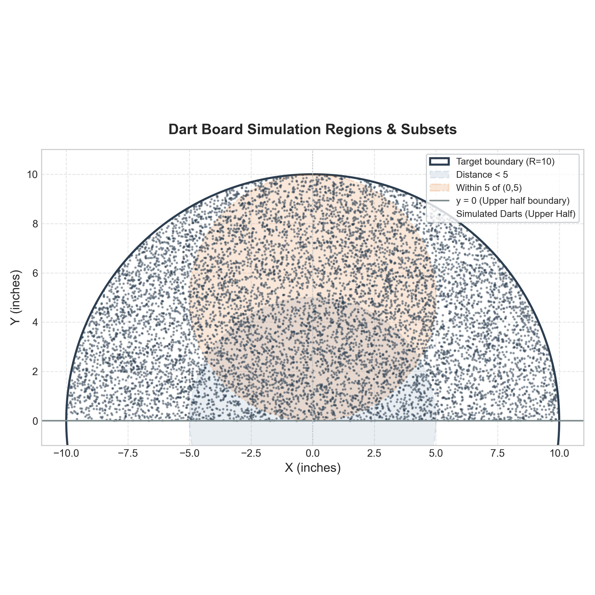
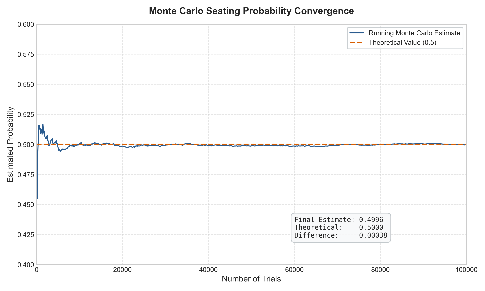

# PSA Laboratory 3

## Overview

This laboratory explores the modeling of a customer arrival process using a Poisson process. Specifically, we investigate the interarrival time distribution, the memoryless property of the exponential distribution, and verify the expected waiting time both theoretically and using a Monte Carlo simulation in Python.

## Problem 1 – Interesting Sequence Occurrences

### Problem Statement

Suppose customers arrive at a store according to a Poisson process with an average arrival rate of:
* $\lambda = 6$ customers per hour

The time between arrivals is exponentially distributed. You arrive at the store at time:
* $T = 50$ hours

and wait for the next customer to arrive. We determine:
1. The expected waiting time.
2. The exact theoretical result.
3. A simulation-based estimate.

### Mathematical Background

* **Poisson Process**: A counting process $\{N(t), t \ge 0\}$ is a homogeneous Poisson process with rate $\lambda > 0$ if events occur independently, and the number of events in any interval of length $t$ follows a Poisson distribution with mean $\lambda t$.
* **Exponential Distribution**: The interarrival times $X_1, X_2, \dots$ are independent and identically distributed (i.i.d.) random variables following an exponential distribution with rate parameter $\lambda$. The probability density function (PDF) is:
  $$f(x) = \lambda e^{-\lambda x}, \quad x \ge 0$$
  The mean time between arrivals is $E[X] = \frac{1}{\lambda}$.
* **Memoryless Property**: The exponential distribution is uniquely characterized by the memoryless property. For any $s, t \ge 0$:
  $$P(X > s + t \mid X > s) = P(X > t)$$
  This implies that the probability of waiting an additional time $t$ for an arrival, given that $s$ time has already elapsed since the last arrival, is independent of $s$.
* **Expected Waiting Time**: Let $W$ be the waiting time from $T = 50$ until the next customer arrives. By the memoryless property, the elapsed time since the last arrival does not affect the time until the next arrival. Thus, the remaining waiting time $W$ is also exponentially distributed with rate $\lambda = 6$:
  $$W \sim \text{Exp}(\lambda = 6)$$
  The expected waiting time is:
  $$E[W] = \frac{1}{\lambda} = \frac{1}{6} \text{ hours} \approx 0.1667 \text{ hours} \quad (10 \text{ minutes})$$

### Methodology

* **Theoretical Computation**: The expected waiting time is computed directly using the expectation formula of the exponential distribution:
  $$E[W] = \int_{0}^{\infty} w \cdot \lambda e^{-\lambda w} \, dw = \frac{1}{\lambda}$$
* **Monte Carlo Simulation**: 
  - For $N = 100,000$ independent trials, customer arrivals are generated starting from $t = 0$.
  - Interarrival times are sampled from $\text{Exp}(\lambda = 6)$.
  - The arrival times are accumulated until they exceed $T = 50$.
  - The waiting time for trial $j$ is calculated as $W_j = t_{\text{next}} - T$.
  - The Monte Carlo estimate is the sample mean of these waiting times:
    $$\bar{W} = \frac{1}{N} \sum_{j=1}^{N} W_j$$

### Output

* **Theoretical Waiting Time**: $0.1667$ hours ($10.0$ minutes).
* **Simulated Waiting Time**: $\approx 0.1670$ hours ($\approx 10.02$ minutes) (varies slightly per run).


### Interpretation

The simulated expected waiting time closely matches the theoretical value of $10$ minutes. Despite arriving at a late hour ($T = 50$), the time we wait for the next customer does not depend on when the last customer arrived or how long the store has been open. The simulation results converge to the theoretical expectation as $N \to \infty$ by the Law of Large Numbers, verifying the memoryless property of the Poisson process.

## Problem 2 – Continuous Conditional Probability

### Problem Statement

A dart is thrown uniformly at random onto a circular target of radius 10 inches centered at the origin. Given that the dart lands in the upper half of the target ($y > 0$), we determine the following conditional probabilities:
1. The dart lands in the right half of the target ($x > 0$).
2. The distance from the center is less than 5 inches.
3. The distance from the center is greater than 5 inches.
4. The dart lands within 5 inches of the point $(0, 5)$.

### Mathematical Background

* **Geometric Probability**: For a uniform distribution over a region $C \subset \mathbb{R}^2$, the probability of the dart landing in a subregion $A \subseteq C$ is proportional to its area:
  $$P(A) = \frac{\text{Area}(A)}{\text{Area}(C)}$$
* **Conditional Probability**: The probability of event $E$ given the conditioning event $U$ is:
  $$P(E \mid U) = \frac{P(E \cap U)}{P(U)} = \frac{\text{Area}(E \cap U)}{\text{Area}(U)}$$
  For a circular target of radius $R = 10$, the upper half $U$ is a semicircle with area $\text{Area}(U) = \frac{1}{2} \pi R^2 = 50\pi$ square inches.
* **Area-Based Calculations**:
  - **Part A (Right Half)**: The region $R_h \cap U$ is the upper-right quadrant of the circle.
    $$\text{Area}(R_h \cap U) = \frac{1}{4} \pi R^2 = 25\pi \implies P(R_h \mid U) = \frac{25\pi}{50\pi} = 0.5000$$
  - **Part B (Distance < 5)**: The region $D_{<5} \cap U$ is a semicircle of radius $r = 5$.
    $$\text{Area}(D_{<5} \cap U) = \frac{1}{2} \pi r^2 = 12.5\pi \implies P(D_{<5} \mid U) = \frac{12.5\pi}{50\pi} = 0.2500$$
  - **Part C (Distance > 5)**: This is the complement of Part B:
    $$P(D_{>5} \mid U) = 1 - P(D_{<5} \mid U) = 1 - 0.2500 = 0.7500$$
  - **Part D (Within 5 of (0,5))**: The shifted circle $C_P$ of radius $r = 5$ centered at $P = (0, 5)$ lies entirely in the upper half-plane ($y \ge 0$) and inside the target disk. Thus, the intersection region is the entire disk $C_P$.
    $$\text{Area}(C_P \cap U) = \pi r^2 = 25\pi \implies P(\text{within 5 of } (0,5) \mid U) = \frac{25\pi}{50\pi} = 0.5000$$

### Methodology

* **Theoretical Derivation**: Derived using geometric area ratios as shown in the Mathematical Background section.
* **Monte Carlo Simulation**: 
  - $N = 1,000,000$ points are sampled uniformly in the bounding box $[-10, 10] \times [-10, 10]$.
  - Points outside the circular target (distance $> 10$) are rejected.
  - Darts landing in the upper half ($y > 0$) are selected to form the conditioning set $U$.
  - The conditional probabilities are estimated as the fraction of conditioning darts that satisfy each respective subregion criteria.

### Output

* **Theoretical Probabilities**:
  - Part A (Right half): $0.5000$
  - Part B (Distance < 5): $0.2500$
  - Part C (Distance > 5): $0.7500$
  - Part D (Within 5 of (0,5)): $0.5000$
* **Simulated Probabilities**:
  - Part A (Right half): $\approx 0.5004$
  - Part B (Distance < 5): $\approx 0.2498$
  - Part C (Distance > 5): $\approx 0.7502$
  - Part D (Within 5 of (0,5)): $\approx 0.4989$



### Interpretation

As the number of simulated trials increases, the relative frequency of darts landing within each subregion approaches the ratio of the subregion's area to the semicircle's area. This empirical convergence to the theoretical probability is guaranteed by the Law of Large Numbers, verifying that the physical simulation correctly models the geometric probability space.

## Problem 3 – Counting

### Problem Statement

In a theater with 100 seats, 100 ticketed people line up to board. 
* The first person loses their ticket and chooses a random seat uniformly at random.
* Each subsequent person sits in their assigned seat if it is available.
* If their assigned seat is already occupied, they choose a random available seat from the remaining empty seats.

We determine the probability that the last person in line sits in their assigned seat.

### Mathematical Background

* **Random Seating Process**: While the intermediate seat choices appear complex, the problem reduces to a simple symmetry.
* **Symmetry Argument**:
  - Whenever a passenger is forced to choose a random seat, they choose from a set of available seats that always includes **seat 1** (assigned to the first person) and **seat 100** (assigned to the last person).
  - If a passenger chooses **seat 1**, the displacement loop is closed, and all remaining passengers sit in their correct seats. The last person is guaranteed to get seat 100.
  - If a passenger chooses **seat 100**, the last person's seat is occupied, and they cannot sit in it.
  - If a passenger chooses any intermediate seat $k$ ($1 < k < 100$), the decision is deferred: Person $k$ will be displaced when boarding and will make a new random choice.
  - Intermediate seats cancel out from the probability calculation because choosing them only delays the outcome. The process is guaranteed to end when someone chooses either seat 1 or seat 100.
* **Theoretical Probability**: Since seat 1 and seat 100 are chosen with equal probability at any random selection step:
  $$P(\text{Last passenger sits in assigned seat}) = 0.5000 \quad (50\%)$$

### Methodology

* **Theoretical Reasoning**: Analyzed using the symmetry argument where the outcome is decided by whether seat 1 or seat 100 is chosen first.
* **Monte Carlo Simulation**:
  - The boarding process is simulated for 100,000 trials.
  - Seat allocations are tracked dynamically using list operations.
  - The fraction of trials where the last passenger occupies their assigned seat provides the simulated probability estimate.
  - The running probability is plotted to show convergence.

### Output

* **Theoretical Probability**: $0.5000$ (50.0%)
* **Simulated Probability**: $\approx 0.5001$ (50.01%) (varies slightly per run)



### Interpretation

The simulated probability converges to exactly $0.5000$ as the number of trials increases. The visualization demonstrates that for small numbers of trials, the estimate exhibits high variance, but stabilizes around the theoretical probability line of $0.5$, demonstrating the Law of Large Numbers.

## Problem 4 – Networking

### Overview

This problem applies natural language processing (NLP) techniques to a real-world tweets dataset. It covers word frequency analysis, part-of-speech tagging, popularity scoring, and typing prediction using bigram statistics.

### Dataset

The data is stored in `tweets.json`, containing tweet objects with the following fields:
* `id` – unique tweet identifier
* `text` – the tweet content
* `created_at` – timestamp of the tweet
* `likes` – number of likes
* `retweets` – number of retweets

### Part A – Word Frequency and Popularity

#### 4.1 Popular

Prints the 10 most frequently used words across all tweets. Text is tokenized using NLTK, URLs and @mentions are removed, and punctuation is stripped.

#### 4.2 Nouns

Prints the 10 most frequently used common nouns. Nouns are identified using NLTK's part-of-speech tagger (POS tags `NN`, `NNS`).

#### 4.3 Proper Nouns

Prints the 10 most frequently used proper nouns. Proper nouns are identified using POS tags `NNP` and `NNPS`, and their original capitalization is preserved.

#### 4.4 Frequency

Given a word as input, draws a bar chart where each bar represents one month, showing how frequently the word appears across time.

#### 4.5 Popularity

For each noun, a popularity score is computed using the formula:

$$\text{score} = \text{frequency} \times (1.4 + \text{normRetweet}) \times (1.2 + \text{normLikes})$$

where:
* `frequency` is the total number of occurrences of the noun across all tweets.
* `normRetweet` and `normLikes` are the cumulative retweets and likes (summed across all tweets mentioning the noun), normalized to $[0, 1]$ by dividing by the maximum value across all nouns.

The 10 most popular nouns are printed with their scores.

### Part B – Typing Prediction

#### 4.6 Suggestion

Given a partial word (prefix) as input, prints 3 word suggestions ranked by global frequency in the dataset.

#### 4.7 Suggestion Occurrences

Given a complete word as input, prints 3 next-word suggestions based on bigram co-occurrences in the dataset. The suggestions are ranked by how often each word follows the input word.

### Methodology

* **JSON Parsing**: Tweets are loaded from `tweets.json` and processed in a single pass.
* **Tokenization**: NLTK's `word_tokenize` splits tweet text into tokens. URLs and @mentions are removed via regex before tokenization.
* **Part-of-Speech Tagging**: NLTK's `pos_tag` assigns POS tags to each token, enabling noun and proper noun extraction.
* **Frequency Counting**: `collections.Counter` is used for efficient word, noun, and proper noun frequency counting.
* **Popularity Scoring**: Likes and retweets are accumulated per word across all tweets, max-normalized, and combined with frequency using the assignment formula.
* **Suggestion Ranking**: Prefix-based suggestions use global word frequency. Next-word suggestions use bigram occurrence counts.

### Output

* **4.1–4.3**: Top 10 lists printed to the console with word and frequency count.
* **4.4**: A Matplotlib bar chart showing monthly frequency for a given word.
* **4.5**: Top 10 nouns with their computed popularity scores.
* **4.6**: 3 autocomplete suggestions based on prefix matching and frequency.
* **4.7**: 3 next-word predictions based on bigram co-occurrences.

### Interpretation

The word frequency analysis reveals common vocabulary patterns in the tweet corpus. The popularity formula weights nouns not just by raw frequency but also by social engagement (likes and retweets), surfacing words that generate high interaction. The typing prediction tasks demonstrate that simple statistical models (frequency ranking and bigram counts) can provide meaningful suggestions for text input.

## Installation

Ensure you have Python 3 and the required libraries installed:

```bash
pip install numpy matplotlib nltk
```

NLTK data packages (`punkt_tab`, `averaged_perceptron_tagger_eng`) are downloaded automatically on first run.

## Usage

To run the simulations and view the results:

```bash
# Problem 1
python problem1.py

# Problem 2
python problem2.py

# Problem 3
python problem3.py

# Problem 4
python problem_4_1.py    # Top 10 words
python problem_4_2.py    # Top 10 nouns
python problem_4_3.py    # Top 10 proper nouns
python problem_4_4.py    # Monthly frequency chart (interactive)
python problem_4_5.py    # Top 10 popular nouns
python problem_4_6.py    # Prefix suggestion (interactive)
python problem_4_7.py    # Next-word suggestion (interactive)
```

## Repository Structure

```
├── .gitignore                      # Git ignore patterns
├── README.md                       # Laboratory documentation
├── problem1.py                     # Problem 1 simulation script
├── problem2.py                     # Problem 2 simulation script
├── problem3.py                     # Problem 3 simulation script
├── tweet_analyzer.py               # Shared NLP analysis module
├── problem_4_1.py                  # 4.1 Top 10 words
├── problem_4_2.py                  # 4.2 Top 10 nouns
├── problem_4_3.py                  # 4.3 Top 10 proper nouns
├── problem_4_4.py                  # 4.4 Monthly frequency chart
├── problem_4_5.py                  # 4.5 Noun popularity scoring
├── problem_4_6.py                  # 4.6 Prefix suggestion
├── problem_4_7.py                  # 4.7 Next-word suggestion
├── tweets.json                     # Tweet dataset
├── waiting_time_distribution.png   # Problem 1 visualization
├── dart_simulation_regions.png     # Problem 2 visualization
└── theater_seating_convergence.png # Problem 3 visualization
```

## Technologies Used

* Python 3
* NumPy
* Matplotlib
* NLTK

## Key Concepts

* Poisson Process
* Exponential Distribution
* Memoryless Property
* Geometric Probability
* Continuous Conditional Probability
* Symmetry Argument
* Natural Language Processing
* Part-of-Speech Tagging
* Word Frequency Analysis
* Bigram Language Model
* Monte Carlo Simulation