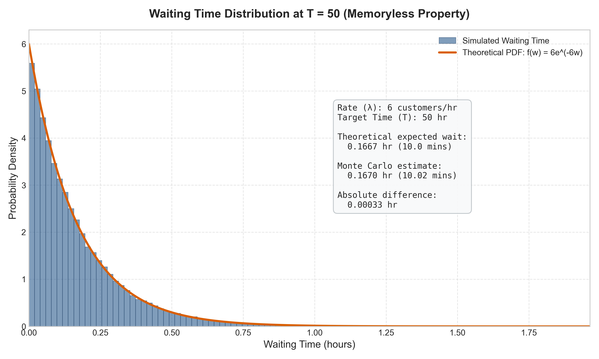

# PSA Laboratory 3

## Overview

This laboratory explores the modeling of a customer arrival process using a Poisson process. Specifically, we investigate the interarrival time distribution, the memoryless property of the exponential distribution, and verify the expected waiting time both theoretically and using a Monte Carlo simulation in Python.

## Problem 1 – Interesting Sequence Occurrences

### Problem Statement

Suppose customers arrive at a store according to a Poisson process with an average arrival rate of:
* $\lambda = 6$ customers per hour

The time between arrivals is exponentially distributed. You arrive at the store at time:
* $T = 50$ hours

and wait for the next customer to arrive. We determine:
1. The expected waiting time.
2. The exact theoretical result.
3. A simulation-based estimate.

### Mathematical Background

* **Poisson Process**: A counting process $\{N(t), t \ge 0\}$ is a homogeneous Poisson process with rate $\lambda > 0$ if events occur independently, and the number of events in any interval of length $t$ follows a Poisson distribution with mean $\lambda t$.
* **Exponential Distribution**: The interarrival times $X_1, X_2, \dots$ are independent and identically distributed (i.i.d.) random variables following an exponential distribution with rate parameter $\lambda$. The probability density function (PDF) is:
  $$f(x) = \lambda e^{-\lambda x}, \quad x \ge 0$$
  The mean time between arrivals is $E[X] = \frac{1}{\lambda}$.
* **Memoryless Property**: The exponential distribution is uniquely characterized by the memoryless property. For any $s, t \ge 0$:
  $$P(X > s + t \mid X > s) = P(X > t)$$
  This implies that the probability of waiting an additional time $t$ for an arrival, given that $s$ time has already elapsed since the last arrival, is independent of $s$.
* **Expected Waiting Time**: Let $W$ be the waiting time from $T = 50$ until the next customer arrives. By the memoryless property, the elapsed time since the last arrival does not affect the time until the next arrival. Thus, the remaining waiting time $W$ is also exponentially distributed with rate $\lambda = 6$:
  $$W \sim \text{Exp}(\lambda = 6)$$
  The expected waiting time is:
  $$E[W] = \frac{1}{\lambda} = \frac{1}{6} \text{ hours} \approx 0.1667 \text{ hours} \quad (10 \text{ minutes})$$

### Methodology

* **Theoretical Computation**: The expected waiting time is computed directly using the expectation formula of the exponential distribution:
  $$E[W] = \int_{0}^{\infty} w \cdot \lambda e^{-\lambda w} \, dw = \frac{1}{\lambda}$$
* **Monte Carlo Simulation**: 
  - For $N = 100,000$ independent trials, customer arrivals are generated starting from $t = 0$.
  - Interarrival times are sampled from $\text{Exp}(\lambda = 6)$.
  - The arrival times are accumulated until they exceed $T = 50$.
  - The waiting time for trial $j$ is calculated as $W_j = t_{\text{next}} - T$.
  - The Monte Carlo estimate is the sample mean of these waiting times:
    $$\bar{W} = \frac{1}{N} \sum_{j=1}^{N} W_j$$

### Output

* **Theoretical Waiting Time**: $0.1667$ hours ($10.0$ minutes).
* **Simulated Waiting Time**: $\approx 0.1670$ hours ($\approx 10.02$ minutes) (varies slightly per run).



### Interpretation

The simulated expected waiting time closely matches the theoretical value of $10$ minutes. Despite arriving at a late hour ($T = 50$), the time we wait for the next customer does not depend on when the last customer arrived or how long the store has been open. The simulation results converge to the theoretical expectation as $N \to \infty$ by the Law of Large Numbers, verifying the memoryless property of the Poisson process.

## Installation

Ensure you have Python 3 and the required libraries installed:

```bash
pip install numpy matplotlib
```

## Usage

To run the simulation and display the results:

```bash
python problem1.py
```

## Repository Structure

```
├── .gitignore                      # Git ignore patterns
├── README.md                       # Laboratory documentation
├── problem1.py                     # Python simulation script
└── waiting_time_distribution.png   # Generated visualization plot
```

## Technologies Used

* Python 3
* NumPy
* Matplotlib

## Key Concepts

* Poisson Process
* Exponential Distribution
* Memoryless Property
* Monte Carlo Simulation